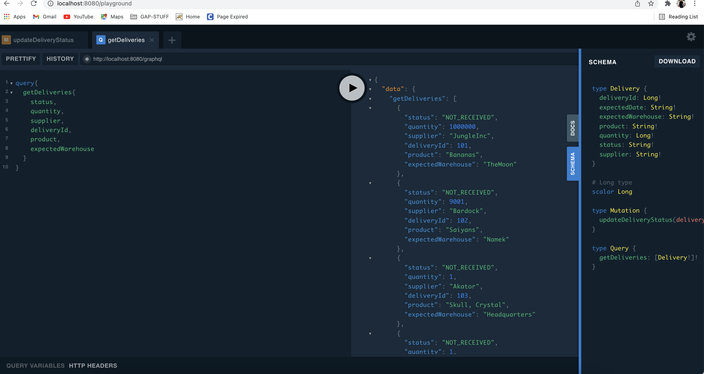
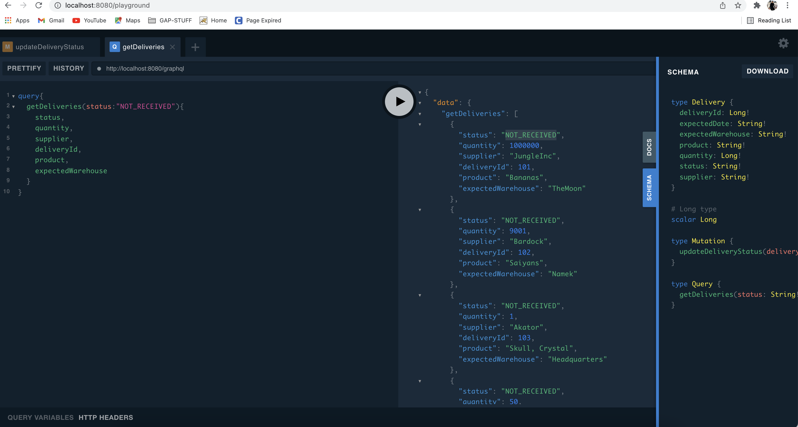
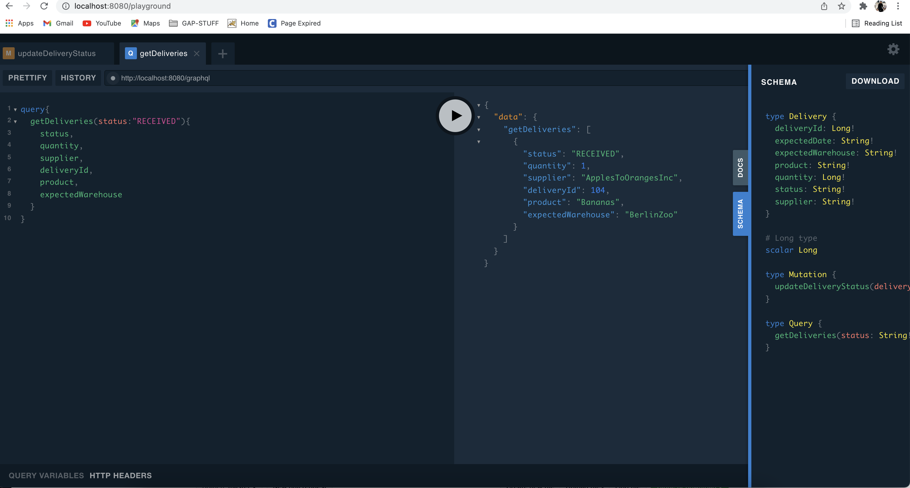

# ms-delivery-service
In this service we are updating the delivery status and fetching all the deliveries that are not received yet. 
This service library built on top of Spring Webflux, provides us with automatic schema generation, graphql-playground
and out of the box support for kotlin coroutines.

Now we start the application and graphql-kotlin automatically creates the schema and the playground
for us. Let's head up to localhost:8080/playground and try some queries.

We see at the left, the query to retrieve our deliveries. We are asking our graphql server to
fetch all the delivery details. There's a play button in the mid-section, click it to make the query.
At the right section we see the actual result of the query and two tabs. The first tab is the documentation
of the API and the second is the schema generated by graphql-kotlin. If we click the docs tab, we see a nice
autogenerated API documentation.

